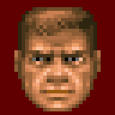
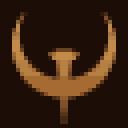
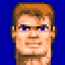

# NDS Ports

PC games ported to the Nintendo DS (and DSi), built with clang and lld on
devkitPro's calico and libnds, which the [toolchain](toolchain) builds from
source. Like the [SerenityOS ports tree](https://github.com/SerenityOS/serenity/tree/master/Ports),
every port fetches a pinned upstream source release and applies patch files on
top, so the upstream code stays untouched in this repository.

## Ports

<table>
<tr>
<td width="100" align="center">
    <a href="./doom">
        <br/>
        DOOM
    </a>
</td>
<td width="100" align="center">
    <a href="./quake">
        <br/>
        Quake
    </a>
</td>
<td width="100" align="center">
    <a href="./wolf3d">
        <br/>
        Wolfenstein 3D
    </a>
</td>
</tr>
</table>

- [DOOM](doom) Based on [doomgeneric](https://github.com/ozkl/doomgeneric) (Chocolate Doom based) - playable
- [Quake](quake) Based on [id Software's Quake](https://github.com/id-Software/Quake) (WinQuake) - playable
- [Wolfenstein 3D](wolf3d) Based on [Wolf4SDL](https://github.com/KS-Presto/Wolf4SDL) - playable

## Port layout

Every port is a self-contained directory:

| Path        | Contents                                                    |
| ----------- | ----------------------------------------------------------- |
| `README.md` | Game data, controls and how the port works                  |
| `build.sh`  | Fetches, patches and builds `target/<port>.nds`             |
| `icon.bmp`  | The 32x32 icon shown in DS menus                            |
| `docs/`     | Screenshot and README icon                                  |
| `patches/`  | The patch series on top of upstream                         |
| `assets/`   | Game data embedded in the ROM (gitignored, never commit it) |
| `target/`   | Sources, work files and the resulting ROM (gitignored)      |

All three ports keep settings and savegames directly in
`/data/<port>/<version>/` on the SD card: Doom uses the WAD filename,
Quake the game folder (such as `id1`), and Wolf3D the data extension
(`wl1`, `wl3` or `wl6`). Shared startup files such as `args.txt` stay in
`/data/<port>/`.

## Getting Started

The ports build with a normal LLVM toolchain (clang 18 or newer, lld and llvm-ar). The
[toolchain](toolchain) script clones calico, libnds, libdvm, FatFs, the
default ARM7 program, ndstool and LLVM's compiler-rt builtins, patches and
builds them the first time you build a port. Install LLVM and the
[melonDS](https://melonds.kuribo64.net/) emulator:

```sh
# macOS
brew install llvm lld
brew install --cask melonds

# Ubuntu 24.04 or newer, older releases need a newer clang from apt.llvm.org
sudo apt install clang lld llvm g++ make git curl unzip melonds
```

- Build a port with its `build.sh`, the ROM ends up in `target/<port>.nds`,
  for example:

  ```sh
  doom/build.sh
  ```

- To change a port, run `./build.sh dev`, edit and commit in the patched source
  tree in `target/`, then `./build.sh export-patches` writes the commits back to
  `patches/`

### melonDS

In melonDS, disable the JIT recompiler (Config > Emu settings > CPU): its
[JIT has a CPU bug](https://github.com/melonDS-emu/melonDS/issues/2622) that
hangs every libnds 2 / calico homebrew on a white screen at boot. Real
hardware and melonDS without JIT are fine.
