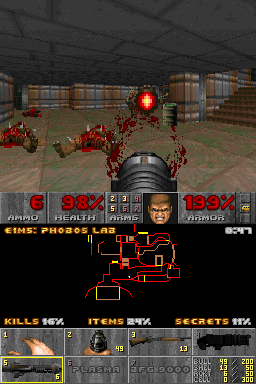

# DOOM for Nintendo DS

A port of [doomgeneric](https://github.com/ozkl/doomgeneric), a portable
fork of Chocolate Doom, to the Nintendo DS and DSi.

## Controls

| Button | In game       | In menus     |
| ------ | ------------- | ------------ |
| D-pad  | Move and turn | Navigate     |
| A      | Fire          | Select / yes |
| B      | Use / open    | Back / no    |
| X      | Next weapon   |              |
| Y      | Run (hold)    |              |
| L / R  | Strafe        |              |
| START  | Menu          | Close menu   |
| Stylus | Tap a weapon  |              |

The top screen only shows the view. The touch screen shows the classic status
bar at the top, the map in the middle, following you, with the level name,
time and the kills, items and secrets as percentages, and at the bottom stone
cells like the status bar's: the weapons, with their pickup picture (the fist
and pistol as held, scaled down), dark until you have them, slot number and
ammo, and the status bar's ammo table. Tap a weapon to select it. The
shareware has no plasma rifle and BFG, those show their name. Outside of a
level and while Options is open the touch screen shows the controls.

Closing the lid puts the console to sleep. L+R+START+SELECT, or the DSi power
button, quits.

Savegames are named after the level, there is no keyboard to type a name.
While playing, the main menu ends the game instead of quitting. Options has
Messages and Sound Volume, with sliders for effects and music, which start at
full volume; the DS volume slider sets the loudness.

## Building

```sh
./build.sh                  # fetch, patch and build target/doom.nds
./build.sh dev              # fetch and patch, then edit and commit in target/doomgeneric-*/
./build.sh export-patches   # write those commits back to patches/
./build.sh clean            # remove target/
```

## Game data

| File                      | Game                                               |
| ------------------------- | -------------------------------------------------- |
| `doom.wad`                | The Ultimate DOOM / DOOM registered (retail)       |
| `doom2.wad`               | DOOM II: Hell on Earth                             |
| `tnt.wad`, `plutonia.wad` | Final DOOM                                         |
| `doom1.wad`               | DOOM shareware, downloaded and embedded by default |

The freely redistributable shareware (episode 1, v1.9) is fetched from
archive.org, checksum verified and embedded in the ROM through NitroFS, so the
`.nds` is always playable, even without an SD card. Add your own retail WADs
next to it in `assets/` to embed them, or put them in `/data/doom/` on the SD
card (the folder next to the `.nds` and the SD root also work).

Every `.wad` found is listed in a picker that shows each game's title screen.
IWADs are games, other WADs are mods (PWADs) and start on a matching IWAD:
DOOM II for MAPxx mods, DOOM for ExMy mods (the shareware can't load mods).

With an SD card the settings and savegames go to `/data/doom/<wad name>/`
(for example `/data/doom/doom1.wad/`), with `default.cfg` written as soon as
the menu closes and `doomsav0.dsg` and up in Doom's own savegame format.
A mod keeps its own settings and saves in `/data/doom/<mod>.wad/`. Without one you can still play,
saving then shows a message instead. Extra command line options such as
`-skill 4` or `-warp 1 3` can be put in `/data/doom/args.txt`.

## Screenshot



## Changes to doomgeneric

The [patches](patches/) apply on top of doomgeneric in order: first the
changes to the engine itself, then the DS platform. Each patch only adds to
or changes upstream code, none changes what an earlier patch added, and the
code is written for the DS only, without `__NDS__` checks.

### Automap and HUD on a second screen

- [0001](patches/0001-Draw-the-automap-into-its-own-framebuffer.patch):
  `AM_SetFramebuffer()` renders the automap into a buffer of its own, such as
  the touch screen. The view, border and status bar keep being drawn on the
  main screen while the map is up, and the automap marks and level name go to
  that screen.
- [0002](patches/0002-Let-the-automap-stay-up-on-a-screen-of-its-own.patch):
  `AM_Start()` keeps the map up all the time, and `am_skipdraw` skips drawing
  it so it can be redrawn every other frame.
- [0003](patches/0003-Expose-the-level-name-and-the-status-bar-face.patch):
  `HU_LevelTitle()` and `ST_FacePatch()` for the touch screen HUD.

### Menus and savegames

- [0004](patches/0004-Answer-prompts-with-the-A-and-B-buttons.patch):
  Prompts ask for A and B instead of Y and N, and Enter and Backspace (which
  A and B send) answer them.
- [0005](patches/0005-Name-savegames-after-the-level.patch): Savegames
  are named after the level, eg. "E1M3: Toxin Refinery", including quicksave
  overwrites.
- [0006](patches/0006-Refuse-saving-without-writable-storage.patch):
  Without an SD card, Save Game and Quick Save show a message instead of
  ending the game with an `I_Error`.
- [0007](patches/0007-Trim-the-menus-for-a-handheld-console.patch): No
  Read This! (keyboard help), graphic detail, screen size or mouse
  sensitivity. Options sits below Save Game, the last main menu item is End
  Game while playing and Quit Game otherwise.
- [0008](patches/0008-Start-sound-and-music-at-full-volume.patch):
  Sound and music start at full volume, the DS speakers are small.
- [0009](patches/0009-Keep-savegames-with-the-game-settings.patch):
  Savegames go directly in the game's config directory, so games don't
  overwrite each other's slots.
- [0010](patches/0010-Keep-the-settings-in-default.cfg.patch): The config
  files, which doomgeneric never read or wrote, keep the settings again,
  written whenever the menu closes. The DS buttons' fire, use and strafe
  keys, which have no PC scancode, are read back as written.

### Rendering

- [0011](patches/0011-Use-the-DS-hardware-divider.patch): The ARM9 has no
  divide instruction, `FixedDiv`, `SlopeDiv` and the scale of every wall
  column use the DS hardware divider. A wall column's division runs while the
  column is set up, and `SlopeDiv` divides 32 bits when it can, which takes
  half as long as 64.
- [0012](patches/0012-Keep-Doom-s-proportions-on-square-pixels.patch):
  Doom's 320x200 had pixels 1.2 times taller than wide on a 4:3 monitor, so on
  the square pixels of the DS the vertical projection is 1.2 times the
  horizontal one (`R_PIXELASPECT`). Walls, sprites, the weapon, floors and the
  sky keep their proportions with the same 90 degree field of view, without
  cropping or stretching.
- [0013](patches/0013-Fill-the-DS-top-screen-with-the-view.patch): The
  view fills the 256x192 top screen at high detail, without status bar or
  border, the rest of the 320x200 frame is black.

### The visible part of the screen

The top screen shows the middle 256x192 of Doom's 320x200 frame 1:1.

- [0014](patches/0014-Draw-menus-and-messages-in-the-visible-part-of-the-s.patch):
  `V_VISIBLE*` describe that part, messages go in its corner and the menus
  are moved inside it, every page centered vertically: it is drawn once
  only measuring it, then moved down.
- [0015](patches/0015-Scale-frames-with-a-picture-for-the-whole-screen.patch):
  Frames with a picture made for the whole screen (title, credits, the
  intermission maps, end pictures) set `v_fullscreenpicture` and are shown
  scaled instead. A wipe between such a frame and the view scales the
  picture into the visible part and runs at 1:1, without jumping.
- [0016](patches/0016-Wrap-texts-at-words-in-the-visible-part-of-the-scree.patch):
  HUD messages, menu messages and finale texts wrap at words.
- [0017](patches/0017-Squeeze-menu-items-wider-than-the-visible-part.patch):
  The three menu items wider than the visible part are squeezed into it.

### Speed

The ARM9 runs at 67 MHz, with 32 KiB of ITCM for code and 16 KiB of DTCM
for data at full speed, 8 KiB instruction and 4 KiB data caches, and 4 MiB
of main RAM on a 16-bit bus at half its clock.

- [0018](patches/0018-Speed-up-the-column-and-span-drawers.patch): The
  drawers keep their tables in registers, the column drawer draws four
  pixels at a time with a free texture wrap and the span drawer stores four
  pixels as one word.
- [0019](patches/0019-Keep-the-light-tables-in-DTCM.patch): The colormaps,
  read for every pixel, live in DTCM.
- [0020](patches/0020-Run-hot-functions-from-ITCM.patch): `HOT_CODE` puts
  single functions in ITCM as ARM code: the automap's line drawing and
  `SlopeDiv`, and in the platform the touch screen's patch drawer and the
  DMA interrupt. The build puts whole files there (0021).

### The DS platform

- [0021](patches/0021-Read-response-files.patch): Response files work
  again, for the options in `/data/doom/args.txt`.
- [0022](patches/0022-Add-a-Nintendo-DS-build.patch): `Makefile.nds` builds
  a DSi enhanced `.nds` with devkitARM and libnds/calico, without the 32-bit
  `DG_ScreenBuffer` and SDL_mixer. The renderer, sight checks, fixed point
  math and `memcpy`/`memset` run from ITCM as ARM code, which is nearly full,
  the rest is Thumb code in main RAM.
- [0023](patches/0023-Add-the-DS-game-picker.patch): `doomgeneric_nds.c`
  switches the ARM9 to 134 MHz in DSi mode, finds every IWAD and mod in
  NitroFS and on the SD card, shows them in a picker with each game's title
  picture, shows a loading screen and keeps config and saves in
  `/data/doom/<wad name>/`, keeping mods apart from their IWADs. Doom runs
  in a thread with its stack in main RAM, DTCM
  mostly holds the colormaps. Also the doomgeneric timing interface.
- [0025](patches/0025-Fit-the-system-layer-to-the-DS.patch): The zone
  takes all free RAM (4 MiB on the DS, 16 MiB on the DSi), `I_Quit` returns to
  the homebrew launcher, `I_Error` shows the message on the touch screen and
  the startup banner fits the 32 column console.
- [0026](patches/0026-Add-DS-video.patch): `i_ndsvideo.c` page flips two
  8bpp VRAM backgrounds on vblank. DMA copies each frame there while the game
  runs its next tic, a row at a time chained by interrupts. Scaled frames use
  the affine background hardware, smoothed by a second layer half a pixel
  further that is alpha blended on top. Doom's palette lives in the hardware
  palette, so damage and pickup flashes cost nothing.
- [0027](patches/0027-Add-DS-buttons.patch): `i_ndsinput.c` maps the
  buttons to game keys while playing and to menu keys in the menus.
- [0028](patches/0028-Add-the-DS-touch-screen.patch): `i_ndstouch.c` draws
  the status bar, automap and weapon cells from the WAD's own graphics, copies
  them to VRAM by DMA and selects a weapon when its cell is tapped. It keeps
  copies of the lumps it draws, Doom makes cached lumps purgeable again when
  it uses them itself.
- [0029](patches/0029-Add-DS-music.patch): `i_ndsmusic.c` plays MUS and
  MIDI on a wavetable synth on hardware channels 8-15, with waveforms per
  instrument family and synthesized drums, sequenced by a 140 Hz thread.
- [0030](patches/0030-Add-DS-sound-effects.patch): `i_ndssound.c` plays
  sound effects on hardware channels 0-7, which do the resampling, volume and
  stereo panning.
- [0031](patches/0031-Copy-memory-fast-on-the-DS.patch): `mem_nds.c`
  replaces newlib's `memcpy` and `memset`, which copy a byte at a time in
  Thumb mode, with word copies from ITCM.
- [0032](patches/0032-Use-single-precision-and-reduce-floating-point-work.patch):
  Float settings are read and written in thousandths without the C
  library's float code, the mouse math is single precision, and the music
  reuses sine samples across harmonics and normalizes with one division per
  wave.
- [0033](patches/0033-Leave-scanf-and-the-float-printf-out.patch): Numbers
  are read with `strtoul` and the settings file line by line, the timedemo
  result is shown in thousandths; `stdio_nds.c` sends all printing to
  newlib's integer-only printf and reads libnds' console escapes with a
  small `siscanf`, so scanf, the float printf and their Unicode tables are
  out of the ROM (72 KiB).
- [0034](patches/0034-Skip-the-WAD-checksum-only-netgames-use.patch): The
  WAD directory's SHA-1, only used by the network client that isn't built,
  isn't worked out at startup.
- [0035](patches/0035-Build-the-trig-tables-at-startup.patch): `finesine`,
  `finetangent` and `tantoangle` are built at startup from a quarter, a
  half and the shrinking steps, the same to the bit (demos stay in sync),
  51 KiB less ROM for 14 KiB more RAM.
- [0036](patches/0036-Pack-the-states-into-20-bytes.patch): `state_t`
  uses shorts for its small fields, 20 bytes a state instead of 28.
