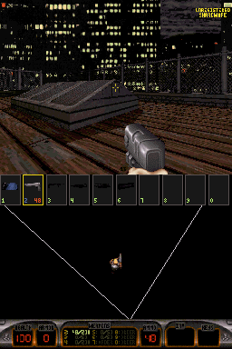

# Duke Nukem 3D for Nintendo DS

A port of [Chocolate Duke3D](https://github.com/fabiensanglard/chocolate_duke3D),
a portable version of the 3D Realms source release faithful to the original,
with Ken Silverman's BUILD engine, to the Nintendo DS and DSi.

## Controls

| Button       | In game                                  | In menus     |
| ------------ | ---------------------------------------- | ------------ |
| D-pad        | Move and turn                            | Navigate     |
| A            | Fire                                     | Select / yes |
| B            | Open / use                               | Back / no    |
| X            | Jump (jetpack up)                        |              |
| Y            | Crouch (jetpack down)                    |              |
| L / R        | Strafe                                   |              |
| SELECT       | Use the inventory item                   |              |
| SELECT+D-pad | Look up and down, pick an inventory item |              |
| START        | Menu                                     | Close menu   |
| Stylus       | Tap a weapon, the item or the map        |              |

The top screen only shows the view, rendered by BUILD at the 256x192 of the
DS, with the messages and the menus, which BUILD scales from 320x200 like at
any resolution. The touch screen is drawn by the game itself: at the top a
cell for each weapon with its pickup picture and ammo, dark until you have
it, the one in your hands in an orange frame, in the middle the overhead map
following you, and at the bottom the game's own status bar. Tap a weapon to
select it, the inventory box of the status bar to use the item in it and the
map to zoom it. Outside of a level and while a menu is open the touch screen
shows the controls. The game always runs, which the original asked of the
keyboard with Caps Lock, but turns a bit slower than running did.

Options has Game Options, with Adult Mode instead of the parental lock and
its password, Setup Sound and Setup Video, with Brightness and Show FPS. The
settings are kept as soon as Options is left. Nothing asks you to type:
savegames are named after the level, also when they replace an older one.

Closing the lid puts the console to sleep. L+R+START+SELECT, or the DSi power
button, quits.

## Building

```sh
./build.sh                  # fetch, patch and build target/duke3d.nds
./build.sh dev              # fetch and patch, then edit and commit in target/chocolate_duke3D-*/
./build.sh export-patches   # write those commits back to patches/
./build.sh clean            # remove target/
```

## Game data

| File         | Game                                                           |
| ------------ | -------------------------------------------------------------- |
| `duke3d.grp` | Duke Nukem 3D shareware v1.3D (episode 1), embedded by default |
| `duke3d.grp` | Duke Nukem 3D v1.3D or Atomic Edition v1.4/v1.5 (retail)       |

The freely redistributable shareware is fetched from 3D Realms' original
`3dduke13.zip` on archive.org, checksum verified and embedded in the ROM
through NitroFS, so the `.nds` is always playable, even without an SD card.
Put your own retail `duke3d.grp` in `assets/` instead to embed it, or in
`/data/duke3d/` on the SD card, which is used first. The shareware demos
are left out, no port of the source release can play them.

With an SD card the settings (`duke3d.cfg`) and savegames go to
`/data/duke3d/<version>/`, `shareware/`, `registered/` or `atomic/`, after
the size of the GRP. Without one you can still play, saving then shows a
message. Extra command line options such as `/v1 /l3 /s2` (episode, level,
skill) can be put in `/data/duke3d/args.txt`. The shareware fits the 4 MiB
of the DS, which leaves about 1.1 MiB for the cache of tiles and sounds; the
DSi has 16 MiB. Only the shareware has been tested.

## Screenshot



## Changes to Chocolate Duke3D

The [patches](patches/) apply on top of Chocolate Duke3D in order: first the
changes to the engine and game, then the DS platform. Each patch only adds to
or changes upstream code, none changes what an earlier patch added, and the
code is written for the DS only, without `__NDS__` checks.

### Fixes

- [0001](patches/0001-Build-with-newlib-and-GCC-16.patch): newlib has no
  `sys/uio.h`, its headers pull in `stdbool.h`, which clashes with parameters
  named `bool`, and has `strlwr`, `strupr` and `itoa` itself. Files in the
  game directory are opened with a forward slash.
- [0002](patches/0002-Align-what-the-cache-holds-to-16-bytes.patch): Ken's
  cache gave out whole 16 byte blocks, Chocolate Duke3D's added 15 bytes to
  every size instead, so nothing in it was aligned, which the ARM can't read
  words and halfwords from.
- [0003](patches/0003-Read-and-write-savegames-without-unaligned-words.patch):
  The LZW codes of the savegames, bit fields at any byte, were read and
  written as words at that byte, which garbled them on the ARM.
- [0004](patches/0004-Know-the-official-GRPs-by-their-size.patch): The whole
  GRP was read at startup for its CRC32, through a 1 MiB buffer, taking many
  seconds from the DS' storage. The official GRPs are known by their size.
- [0005](patches/0005-Don-t-wait-for-sounds-and-answers-that-never-come.patch):
  Starting a new game and the end of episode 3 waited in empty loops for a
  voice to end, which on the DS never ended, so New Game hung on the skill
  menu. Console questions are answered without a keyboard.
- [0006](patches/0006-Check-the-command-line-options.patch): Options that
  take an argument check it is there, and `/g` no longer writes past its own.

### Memory

The DS has 4 MiB of RAM for everything, Duke Nukem 3D asked for 8.

- [0007](patches/0007-Fit-in-the-4-MiB-of-the-DS.patch): The screen arrays
  are sized for 320x320, the tilted view when you die, not 1600x1200, and an
  unused 72 KB music buffer is gone.
  The tile cache takes all free memory but 192 KB, for the music, the files
  and the rest of the game.

### Speed

The ARM9 runs at 67 MHz, with 32 KiB of ITCM for code and 16 KiB of DTCM
for data at full speed, 8 KiB instruction and 4 KiB data caches, and 4 MiB
of main RAM on a 16-bit bus at half its clock.

- [0008](patches/0008-Speed-up-the-drawers.patch): The C versions of Ken's
  assembly drawers kept their state in globals and counted every pixel for a
  debugging feature. They keep it in registers, the wall drawer does two
  columns at a time, a halfword per row, and the counter is gone. Twice the
  frame rate.
- [0009](patches/0009-Clear-and-copy-buffers-a-word-at-a-time.patch):
  `clearbufbyte` and `copybufbyte` work by words.
- [0010](patches/0010-Use-the-DS-hardware-divider.patch): `scale` and
  `divscale`, 64 by 32 bit divisions, use the DS hardware divider.

### Menus, controls and savegames

- [0011](patches/0011-Answer-prompts-with-the-A-and-B-buttons.patch): The
  prompts ask for A and B instead of Y and N, and dying says to press B.
- [0012](patches/0012-Turn-slower-when-running.patch): Running
  turned twice as fast as walking, too fast to aim with the d-pad, which
  always runs. Now it turns 1.5 times as fast.
- [0013](patches/0013-Trim-the-menus-for-a-handheld-console.patch): No
  keyboard, mouse or video mode setup, no demo recording or multiplayer
  opponent sound, and Adult Mode turns on and off without a password.
- [0014](patches/0014-Keep-the-settings-when-Options-is-left.patch): The
  settings were only written on quitting, now whenever Options is left.
- [0015](patches/0015-Name-savegames-after-the-level.patch): Savegames are
  named after the level, there is no keyboard to type a name.
- [0016](patches/0016-Keep-the-savegame-picture-until-the-game-is-saved.patch):
  The picture saved with a game was left to the cache, which could drop it
  before a slot was picked and then saving crashed.
- [0017](patches/0017-Show-a-message-when-a-savegame-can-t-be-written.patch):
  Without an SD card saving says so instead of silently doing nothing.

### The DS platform

- [0018](patches/0018-Add-a-Nintendo-DS-build.patch): `Makefile.nds` builds
  a DSi enhanced `.nds` with devkitARM and libnds/calico. The engine is ARM
  code, its drawers and `memcpy`/`memset` run from ITCM, the game is Thumb
  code, what doesn't run every frame optimized for size. `int32_t` is made an
  `int` like on the PC, newlib's is a `long`.
- [0019](patches/0019-Add-the-DS-startup.patch): `duke3d_nds.c` switches
  the ARM9 to 134 MHz in DSi mode, finds the GRP in NitroFS and on the SD
  card, shows the progress on the touch screen, keeps settings and saves in
  `/data/duke3d/<version>/`, reads `args.txt` and runs the game in a thread
  with its stack in main RAM. Errors are shown on the touch screen.
- [0020](patches/0020-Add-DS-video.patch): `display_nds.c` replaces the SDL
  driver. BUILD renders into main RAM, DMA copies each frame to one of two
  8bpp VRAM pages a few rows at a time, chained by interrupts, while the
  game goes on, and pages and palette are flipped on vblank, so palette
  effects cost nothing. A palette set on a still screen, like the end of a
  fade, is shown on its own. The 120 Hz timer counts from the hardware tick
  counter.
- [0021](patches/0021-Keep-the-renderer-s-tables-and-hot-code-in-fast-memo.patch):
  The shade tables of the palettes other than the first, about 200 KB, and
  the 64 KB translucency table are only read once made, they go to VRAM
  banks C, D and E. The first shade table, read for most pixels, is in DTCM
  and the renderer's hottest functions run from ITCM.
- [0022](patches/0022-Add-DS-buttons.patch): `input_nds.c` sends the
  buttons as keyboard scancodes, the keys of the game functions while
  playing and the menu keys elsewhere, keeping the key sent on press so the
  release always matches.
- [0023](patches/0023-Add-the-DS-touch-screen.patch): `hud_nds.c` has the
  game draw the touch screen into a frame of its own, the status bar by the
  game's own code as if the view were small, and copies what changed to
  VRAM banks H and I. The view fills the top screen.
- [0024](patches/0024-Add-DS-sound-effects.patch): `fx_nds.c` is the FX
  interface of the Apogee Sound System on hardware channels 0-7, which do
  the resampling, volume and panning. VOC and WAV samples are aligned and
  made signed in place the first time they play.
- [0025](patches/0025-Add-DS-music.patch): `music_nds.c` is the MUSIC
  interface with the DOOM port's wavetable synth on channels 8-15, the MIDI
  songs converted to an event stream that a 140 Hz thread plays.
- [0026](patches/0026-Copy-memory-fast-on-the-DS.patch): `mem_nds.c`
  replaces newlib's `memcpy`, `memmove` and `memset`, which copy a byte at a
  time in Thumb mode, with word copies from ITCM.
- [0027](patches/0027-Leave-scanf-and-the-float-printf-out.patch): The
  settings parser reads quotes and floats itself, and `stdio_nds.c` sends
  all printing to newlib's integer-only printf, which leaves scanf and the
  float printf out of the ROM (64 KB).
