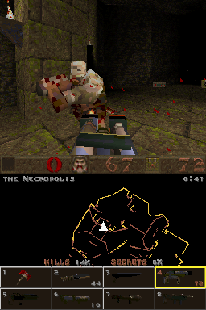

# Quake for Nintendo DS

A port of id Software's [GPL Quake source](https://github.com/id-Software/Quake)
(WinQuake) to the Nintendo DS and DSi, rendered by the DS 3D hardware.

## Controls

| Button | In game       | In menus     |
| ------ | ------------- | ------------ |
| D-pad  | Move and turn | Navigate     |
| A      | Fire          | Select / yes |
| B      | Jump          | Back / no    |
| X      | Next weapon   |              |
| Y      | Run (hold)    |              |
| L / R  | Strafe        |              |
| START  | Menu          | Close menu   |
| SELECT | Scores        |              |
| Stylus | Tap a weapon  |              |

The top screen shows the 3D view, with the messages and center prints over
it, like on a PC. The touch screen shows the status bar at the top, the map in
the middle, following you, with the level name, time, the keys, powerups and
runes you carry and the kills and secrets as percentages, and at the bottom a
cell for each weapon, drawn from its model, with its ammo, dark until you have
it, the one in your hands in a yellow frame. Tap a weapon to select it. When
you die, or hold SELECT, the map makes way for the kills, secrets and time.

The game starts in the main menu, which is on the top screen over the demos.
The main menu has New Game, Load, Save, Options and Quit. Options has Reset to
defaults, Brightness, Sound Volume, Always Run and Crosshair. While a menu is
open the touch screen keeps showing the game, with the options and while no
game runs it shows the controls, centered on the console background. While
Quake starts the touch screen shows its title in brown and loading dots like
DOOM and Wolf3D, and the top screen the loading plaque, which also shows
whenever a level loads. Nothing asks you to type: savegames are named after
the level and kills, and the player after the user name of the DS settings.

Closing the lid puts the console to sleep. L+R+START+SELECT, or the DSi power
button, quits.

## Building

```sh
./build.sh                  # fetch, patch and build target/quake.nds
./build.sh dev              # fetch and patch, then edit and commit in target/Quake-*/
./build.sh export-patches   # write those commits back to patches/
./build.sh clean            # remove target/
```

## Game data

`assets/` is Quake's base directory: game data goes in `assets/id1/` and mods
in their own directory next to it, like `assets/hipnotic/`.

| File           | Game                                                            |
| -------------- | --------------------------------------------------------------- |
| `id1/pak0.pak` | Quake shareware (episode 1), downloaded and embedded by default |
| `id1/pak1.pak` | Quake registered (retail), episodes 2 to 4                      |

The freely redistributable shareware v1.06 is fetched from archive.org,
checksum verified and embedded in the ROM through NitroFS, so the `.nds` is
always playable, even without an SD card. Add your own `pak1.pak` next to it
in `assets/id1/` to embed it, or put it in `/data/quake/id1/` on the SD card.
Both are searched, the SD card last.

With an SD card the config and savegames go to `/data/quake/id1/`, in Quake's
own format, named after the level, also when they replace an older one.
Without one you can still play, saving then shows a message. Extra
command line options such as `-game hipnotic` or `+map e1m2` can be put in
`/data/quake/args.txt`. The 4 MiB of the DS fit the id maps, the mission
packs and big mods need the 16 MiB of the DSi.

## Screenshot



## Changes to Quake

The [patches](patches/) apply on top of Quake in order: first the changes to
the game itself, then the DS platform. Each patch only adds to or changes
upstream code, none changes what an earlier patch added, and the code is
written for the DS only, without `__NDS__` checks.

### Fixes

- [0001](patches/0001-Fix-undefined-behavior-that-modern-GCC-miscompiles.patch):
  Two loops filled two dimensional arrays past the end of their first row,
  which modern GCC cuts short, and `SV_RecursiveHullCheck` had no prototype
  for its float arguments.

### Menus and screens

- [0002](patches/0002-Answer-prompts-with-the-A-and-B-buttons.patch):
  Enter (A) also answers yes, only when pressed while the question shows,
  and the quit messages ask for A and B instead of Y and N.
- [0003](patches/0003-Trim-the-menus-for-a-handheld-console.patch): The
  main menu has New Game, Load, Save, Options and Quit on one level, cut out
  of the single player and main menu pictures, there is no network play and
  the help is about the keyboard. Options lose the
  console, the key bindings, the mouse settings, screen size, CD music and
  video modes, and get a Crosshair switch. Leaving them writes `config.cfg`
  right away, not only on quitting.
- [0004](patches/0004-Start-in-the-main-menu.patch): The demo loop starts
  with the main menu open, the demos keep playing behind it.
- [0005](patches/0005-Put-the-messages-and-center-prints-on-the-top-screen.patch):
  The notify lines and center prints are text on the top screen
  (`vid_textlayer`), over the view, 32 columns wide, a long notify line goes
  on at its last word.
- [0006](patches/0006-Wrap-center-prints-at-words.patch): Center prints
  and the episode end texts are wrapped again at words to fit the 32 columns.
- [0007](patches/0007-Put-the-menus-on-the-top-screen.patch): The menus
  are drawn on a transparent background, the video driver shows them on the
  top screen over the dimmed view, every page in the middle of the screen,
  which the cursor doesn't move, and without the Quake plaque on the left.
  A page is only drawn again when it changes, so the game keeps its speed
  behind the menu.
- [0008](patches/0008-Show-a-loading-screen.patch): The loading plaque
  shows on the top screen whenever a level loads, also for a game started
  from the menu, instead of the frozen screen and then the console. A
  level, savegame or demo that can't be loaded ends it again.
- [0009](patches/0009-Show-savegame-slots-instead-of-paths.patch): Saving
  and loading name the slot, eg. "Game saved in slot 1", instead of the path
  of the file.
- [0010](patches/0010-Draw-the-intermission-numbers-without-gaps.patch): The
  time, secrets and kills of the intermission are each one string, like
  "12/47", instead of right aligned fields with gaps.
- [0011](patches/0011-Draw-the-status-bar-at-the-top-of-the-touch-screen.patch):
  The status bar is at the top of the touch screen (`SBAR_Y`), right below
  the view, without the inventory.

### Memory

The DS has 4 MiB of RAM for everything, Quake asked for 8.

- [0012](patches/0012-Keep-brush-models-and-skins-out-of-RAM.patch): Maps
  are read from the file a lump at a time instead of all at once. Textures
  and skins go to VRAM, the renderer reads them from the files, and the
  vertexes, edges and light maps are freed once the 3D hardware has its own
  vertices and vertex light. A file's temporary memory goes back to the
  cache once it's read.
- [0013](patches/0013-Fit-in-the-4-MiB-of-the-DS.patch): 2 MiB of minimum
  memory, one client slot, 512 particles, 448 edicts with less than 8 MiB
  and the pack directory off the stack. The cache holds less than a
  level's models, so it no longer throws out what is in use: data in the
  way of the hunk moves, the least recently used goes instead, an alias
  model frees its file before it's copied to the cache, sounds and their
  files only push out data unused for 10 frames, a driver playing from the
  cache is told when data moves, and the server and client only read the
  headers of alias models. This fixed 2 fps fights in e1m2 and e1m3 and
  makes levels load up to 40% faster.

### Speed

The ARM9 runs at 67 MHz (134 MHz on the DSi) without a floating point unit,
with 32 KiB of ITCM for code and 16 KiB of DTCM for data at full speed.

- [0014](patches/0014-Run-the-local-server-at-20-Hz.patch): The local
  server, its physics and QuakeC, runs at 20 Hz instead of every frame, the
  client interpolates the entities in between. A short button press between
  two server frames still counts.
- [0015](patches/0015-Use-single-precision-sine-and-cosine.patch):
  `AngleVectors` uses the float sine and cosine, a lot cheaper in software.
- [0016](patches/0016-Work-out-the-sound-positions-in-integers.patch):
  `SND_Spatialize` works in integers with the DS square root and divider
  units.
- [0017](patches/0017-Keep-the-QuakeC-program-loaded.patch): `progs.dat`
  is loaded by the first level and stays, the next levels only read its
  globals again instead of reading and checking all 400 KiB, half a second
  less for every level.
- [0018](patches/0018-Compare-with-the-planes-instead-of-subtracting.patch):
  `SV_HullPointContents` and `Mod_PointInLeaf` compare a point with a
  plane's distance instead of subtracting it first, a software float
  operation less for every BSP node, which monsters walking around do a lot.
- [0019](patches/0019-Leave-freed-hunk-memory-as-it-is.patch): Freed hunk
  memory isn't cleared, allocations clear their own, which saves clearing
  every temporary file buffer while a level loads.

### The DS platform

- [0020](patches/0020-Add-a-Nintendo-DS-build.patch): `Makefile.nds`
  builds a DSi enhanced `.nds` with devkitARM and libnds/calico. The
  collision code, `memcpy`/`memset` and libgcc's software floating point,
  taken out of libgcc, run from ITCM as ARM code, `HOT_CODE` puts single
  functions there, like the QuakeC interpreter, the rest is Thumb code in
  main RAM. Float comparisons come from `fcmp_nds.s`, without the three
  calls and five saved registers of libgcc's, which made a fifth of the
  time in fights. Constants are single precision, so they don't drag
  expressions to double.
- [0021](patches/0021-Add-the-DS-system-layer.patch): `sys_nds.c` switches
  the ARM9 to 134 MHz in DSi mode, runs Quake in a thread with its stack in
  main RAM (Quake keeps arrays of up to 32 KiB on the stack, the ARM9 stack
  is in the 16 KiB DTCM), gives the hunk all RAM that is left, reads
  `args.txt`, shows a DOOM-like startup naming the game it loads (shareware,
  full game, mission pack or mod) with loading dots and errors on the
  touch screen. The game data in the ROM
  is searched before the SD card, which gets the written files. The player is
  named after the user of the DS settings.
- [0022](patches/0022-Add-the-DS-3D-renderer.patch): `r_nds.c` draws the
  world, brush and alias models, sprites and particles with the geometry
  engine. Vertices are 16-bit fixed point world coordinates and surfaces are
  quad strips zig-zagging across their polygons. Textures stay 8-bit in VRAM
  banks A, B and D with Quake's palette in the texture palette, so the
  palette shifts for damage and pickups are free, twice as bright so the
  light can overbright like the software renderer. The ammo and health boxes
  share their textures. Light maps become vertex light for each light style,
  so flickering lights still animate, and dynamic lights light the world
  too. T-junctions get their vertices added and strips start where the
  hardware tells the side polygons face right, so walls have no cracks, and
  skins are filled in around what their triangles cover, so the shotguns
  have no blue edges. The sky has both layers on a flattened sphere like
  GLQuake. The depth buffer holds w, so monsters behind doors don't show
  through them, the near plane is close and swimming the eye stays far
  enough from the surface that it isn't cut out of view. The weapon's depth
  is a third so it doesn't poke into walls, the crosshair is a pixel-exact 7
  by 7 cross.
  Alias models are joined into triangle strips of 10-bit vertices, placed
  relative to the eye so they don't wobble. The surfaces' hardware data is
  packed without pointers and the temporary memory is freed after a load,
  so the cache has room for every shareware level's models and sounds. The world traversal, culling,
  lighting, alias models and particles run from ITCM. The world's vertex
  colors are worked out while the hardware still waits to show the last
  frame. A level reads each alias model's file once, for its skins and the
  model.
- [0023](patches/0023-Add-DS-video.patch): `vid_nds.c` shows the 3D view
  on the top screen with a text layer over it, Quake's font and the loading
  plaque as tiles. Edge marking fills the polygon edges. The touch screen shows the
  320x200 2D drawing scaled by the affine background hardware, smoothed by a
  second layer half a pixel further that is alpha blended on top
  (`vid_smooth`), only the rows that changed are copied. The menu draws
  into the same buffer, whose rows get back what the touch screen shows
  when drawn again: it's cut into tiles for the same layers on the top
  screen, scrolled to the middle, only the tiles with something on them take
  VRAM and only the ones that changed are copied.
- [0024](patches/0024-Add-DS-buttons.patch): `in_nds.c` maps the buttons
  to Quake's keys and taps to the weapons and handles the lid and power
  button.
- [0025](patches/0025-Add-the-DS-touch-screen.patch): `sbar_nds.c` draws
  the map, stats and weapon cells below the status bar with Quake's own
  graphics, redrawn only where they changed. The weapons are drawn from their
  models when the game starts, textured and lit. The map is a line for each
  wall of the world seen from above, the bottom edge of sloped ones like
  vaults, made when the map loads, shown once the renderer drew the wall. When you are dead it shows the kills, secrets and
  time in the intermission's big numbers instead. With the options and while
  no game runs behind the menu it shows the controls in a dark inset in the
  middle of the console background. When you die the time stops.
- [0026](patches/0026-Add-DS-sound.patch): `snd_nds.c` plays every sound
  channel on a hardware channel of its own, which does the resampling,
  volume and stereo panning, instead of mixing them in software: the
  ambient and entity sounds on channels 0-11, the four loudest static
  sounds (torches, machines) on 12-15. Sounds load when they first play,
  not with the level, and only the sounds that play stay in the cache, the
  ambient ones only near water or sky, so the models aren't pushed out of
  it.
- [0027](patches/0027-Copy-memory-fast-on-the-DS.patch): `mem_nds.c`
  replaces newlib's `memcpy` and `memset`, which copy a byte at a time in
  Thumb mode, with word copies from ITCM.
