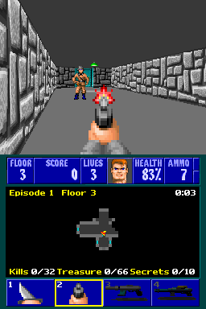

# Wolfenstein 3D for Nintendo DS

A port of [Wolf4SDL](https://github.com/KS-Presto/Wolf4SDL), the portable
source port of id Software's Wolfenstein 3D, to the Nintendo DS and DSi.

## Controls

| Button | In game       | In menus     |
| ------ | ------------- | ------------ |
| D-pad  | Move and turn | Navigate     |
| A      | Fire          | Select / yes |
| B      | Open / use    | Back / no    |
| X      | Next weapon   |              |
| Y      | Run (hold)    |              |
| L / R  | Strafe        |              |
| START  | Menu          | Back         |
| Stylus | Tap a weapon  |              |

The title shows while the game loads and stays with its music until you
press a button, then the main menu shows: New Game, Load Game, Save Game,
View Scores, Back to Demo (or B), which shows the title and the demos, and
Quit. In a game End Game takes the place of Quit.
All the sound is always on, the DS volume slider sets the loudness.

The top screen shows the view at 1:1, the menus and pictures are scaled to
fit. The touch screen looks like the status bar: the status bar itself at the
top, the map in the middle, following you, with the episode, floor and time
and the kills, treasure and secrets as percentages, and at the bottom a cell
for each weapon, in color, dark until you have it, the one in your hands in a
gold frame. Tap a weapon to select it. The map shows the explored part of the
level, the walls in the colors of their textures, the doors in the colors of
their keys and the items you have seen: treasure gold, health green, ammo and
weapons gray, extra lives blue. Outside of a game the touch screen shows the
controls.

Closing the lid puts the console to sleep. L+R+START+SELECT, or the DSi power
button, quits.

Nothing asks you to type: savegames are named after the episode and floor,
also when they replace an older one, so selecting a slot saves right away,
overwriting an existing save asks for confirmation. Quicksave also updates
the name to the current level. A new high score gets the user name of the DS
settings.

## Building

```sh
./build.sh                  # fetch, patch and build target/wolf3d.nds
./build.sh dev              # fetch and patch, then edit and commit in target/Wolf4SDL-*/
./build.sh export-patches   # write those commits back to patches/
./build.sh clean            # remove target/
```

## Game data

| Files   | Game                                                              |
| ------- | ----------------------------------------------------------------- |
| `*.wl6` | Wolfenstein 3D v1.4, Apogee or GT/id/Activision (Steam, GOG) data |
| `*.wl3` | Wolfenstein 3D v1.4, episodes 1 to 3                              |
| `*.wl1` | Wolfenstein 3D shareware v1.4, downloaded and embedded by default |

The freely redistributable shareware (episode 1) is fetched from archive.org,
checksum verified and embedded in the ROM through NitroFS, so the `.nds` is
always playable, even without an SD card. Add the data files of your own
full game (`audiohed`, `audiot`, `gamemaps`, `maphead`, `vgadict`,
`vgagraph`, `vgahead` and `vswap`) to `assets/` to embed them, or put them
in `/data/wolf3d/` on the SD card (the folder next to the `.nds` and the SD
root also work). The full game is played when it is found, it has the
shareware episode too. Spear of Destiny needs a build of its own and isn't
supported.

With an SD card the config and savegames go to `/data/wolf3d/`. Without one
you can still play, saving then shows a message instead. Wolf4SDL's command
line options such as `--goobers` or `--tedlevel 3 --hard` can be put in
`/data/wolf3d/args.txt`.

## Screenshot



## Changes to Wolf4SDL

The [patches](patches/) apply on top of Wolf4SDL in order: first the
changes to the game itself, then the DS platform. Each patch only adds to
or changes upstream code, none changes what an earlier patch added, and the
code is written for the DS only, without `__NDS__` checks.

### Game data

- [0001](patches/0001-Run-the-shareware-and-GT-data-in-Apogee-v1.4-builds.patch):
  The Apogee v1.4 graphics layout is a superset of the others, the GT, id
  and Activision data lacks twelve "Read This!" pictures and the shareware
  the end texts of episodes 2 to 6. Their chunks are marked missing, so one
  build plays the shareware, the Apogee and the GT/id/Activision data.
- [0002](patches/0002-Skip-the-digitized-sounds-the-data-lacks.patch):
  The digitized sounds the shareware lacks stay AdLib sounds instead of
  ending the game.
- [0003](patches/0003-Size-the-output-of-ltoa-right-and-use-newlib-s-itoa.patch):
  `ltoa` sized its output by the old contents of the buffer, newlib has an
  `itoa` of its own.

### Menus and savegames

- [0004](patches/0004-Answer-prompts-with-the-A-and-B-buttons.patch):
  Prompts name the A and B buttons, which answer them, instead of Y and N.
- [0005](patches/0005-Name-savegames-and-high-scores-without-typing.patch):
  Savegames are named after the level, eg. "Episode 1 Floor 3", also when
  they replace an older one, without a name-editing step. Quicksave updates
  the name too. A new high score gets the user name of the DS settings and
  is kept right away, not only on quitting.
- [0006](patches/0006-Show-a-message-when-a-savegame-can-t-be-written.patch):
  Without an SD card saving shows a message instead of crashing.
- [0007](patches/0007-Trim-the-menus-for-a-handheld-console.patch): No
  Read This! (keyboard help) or Change View, New Game is selected first and
  the episodes the shareware lacks say where the full game goes. There is
  no Control menu, the buttons are the joystick, without mouse or keyboard,
  and no Sound menu, all the sound is on. In a game there is no Quit. B
  leaves the main menu like Back to Game/Demo instead of asking to quit.
- [0008](patches/0008-Start-in-the-main-menu.patch): The game starts with
  the title and its music until a button is pressed, then the main menu,
  without the signon screen and its "Press a key" or the PG13 screen, and
  goes back to the menu after a game. It shows no empty frame while
  it loads, so the title can show meanwhile.

### Rendering

- [0009](patches/0009-Use-the-DS-hardware-divider.patch): The ARM9 has
  no divide instruction, `FixedDiv` and the height of every wall column use
  the DS hardware divider.
- [0010](patches/0010-Keep-Wolfenstein-s-proportions-on-square-pixels.patch):
  Wolfenstein's 320x200 had pixels 1.2 times taller than wide on a 4:3
  monitor, so on the square pixels of the DS heights are 1.2 times the widths
  (`PIXELASPECT`). Walls, sprites and the weapon keep their proportions with
  the same field of view.
- [0011](patches/0011-Fill-the-DS-top-screen-with-the-view.patch): The
  view always is the 256x192 of the top screen, in the top left corner of
  the 320x200 screen, without status bar or border. `viewonscreen` tells the
  platform when the screen shows it, from its first frame until the screen
  fades out, other frames are made for 320x200 and shown scaled. Get Psyched
  is drawn in the view too, without the status bar under it.
- [0012](patches/0012-Draw-the-view-through-strips-in-DTCM.patch):
  Writing the view down the columns of the frame misses the data cache with
  every pixel, so the ray caster and the sprites only note their columns and
  the view is put together in strips of 8 columns in DTCM: the ceiling and
  floor, the wall posts and the sprite columns over them, then copied into
  the frame in doublewords. The texture steps in fixed point from a copy of
  its column in DTCM, four pixels per loop.

### The DS platform

Wolf4SDL runs on a small implementation of the parts of SDL 2 and SDL_mixer
it uses, in `nds/`, so its own code is barely changed.

- [0013](patches/0013-Add-a-Nintendo-DS-build.patch): `Makefile.nds`
  builds the `.nds` with devkitARM and libnds/calico, with the Apogee v1.4
  graphics layout. The ray caster, the scaler, the fixed point math and
  `memcpy`/`memset` run from ITCM as ARM code, the rest is Thumb code in
  main RAM.
- [0014](patches/0014-Add-the-DS-startup.patch): `wl_nds.c` switches the
  ARM9 to 134 MHz in DSi mode, finds the game data in NitroFS and on the SD
  card, keeps config and saves in `/data/wolf3d/` and reads `args.txt`.
  The touch screen shows a startup like DOOM's and Quake's, in blue, naming
  the game it loads, the full game or the shareware. As
  soon as the data is found, it shows the title on the top screen while the
  game loads, expanding only its chunk of the graphics. Errors are shown on
  the touch screen.
- [0015](patches/0015-Add-the-SDL-core-on-the-DS.patch): `sdl.c` and the
  SDL headers: initialization, time and message boxes.
- [0016](patches/0016-Add-DS-video.patch): `sdl_video.c` page flips two
  8bpp VRAM backgrounds on vblank. DMA copies each frame there while the game
  draws the next one, a row at a time chained by interrupts, only the view
  while the screen shows it, at 1:1. A whole new view reaches the screen
  surface by swapping their pixels instead of a copy.
  Other frames use the affine background hardware to scale, smoothed by a
  second layer half a pixel further that is alpha blended on top. The game
  palette is the hardware palette, so fades and flashes cost nothing.
- [0017](patches/0017-Add-DS-buttons.patch): `sdl_input.c` makes START the
  escape key and the other buttons Wolfenstein's joystick, which is always
  enabled. The d-pad turns slower than it moves, at half speed for the first
  tics so a tap can aim.
- [0018](patches/0018-Add-the-DS-touch-screen.patch): `wl_touch.c` draws
  the status bar, the map and the weapon cells from the game's own graphics,
  the weapons from their sprites (the machine guns as picked up, the knife
  and pistol as held), copies the parts that changed to VRAM by DMA, selects the weapon tapped
  and handles the lid and power button. The map is a bitmap background of
  its own, scrolled by the hardware to follow the player and shown in its
  panel by a window, so only the tiles that change are drawn.
- [0019](patches/0019-Add-DS-sound.patch): `sdl_mixer.c` plays the digitized
  sounds as they are on hardware channels 0-5, with the positional stereo of
  Wolf4SDL, and mixes the music hook and the PC speaker into a stream on
  channel 6 from a 700 Hz thread.
- [0020](patches/0020-Play-the-AdLib-on-the-DS-sound-hardware.patch):
  `opl.c` plays the OPL2 register writes on the sound hardware instead of
  emulating the chip sample by sample, which took most of the ARM9: every OPL
  channel is a hardware channel looping one period of the waveform its two
  FM operators make, at its pitch, with the envelopes, key scaling and levels
  of the MAME emulator done in software.
- [0021](patches/0021-Copy-memory-fast-on-the-DS.patch): `mem.c` replaces
  newlib's `memcpy` and `memset`, which copy a byte at a time in Thumb mode,
  with word copies from ITCM.
- [0022](patches/0022-Use-single-precision-and-reduce-floating-point-work.patch):
  Use single-precision trig, projection and AdLib tables; share the
  direction-to-angle conversion and replace its division with multiplication.
